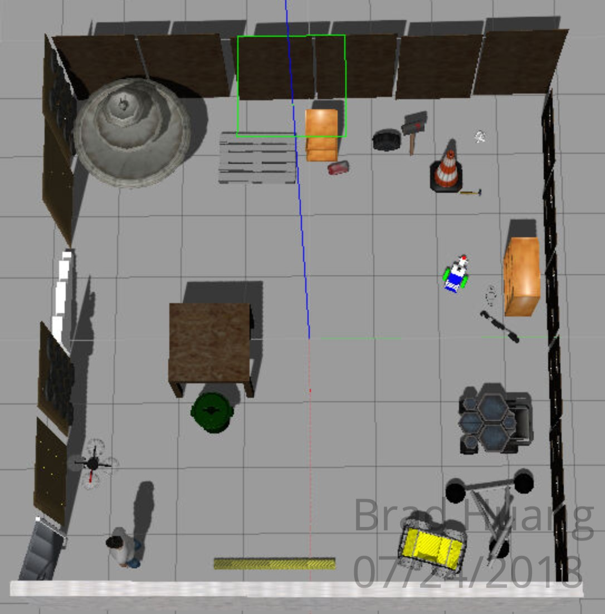
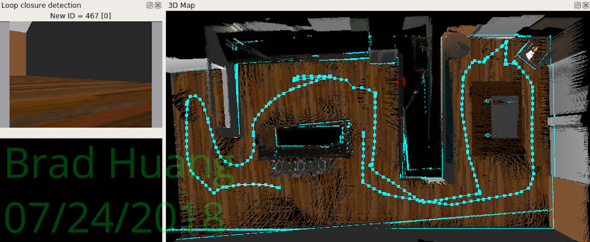
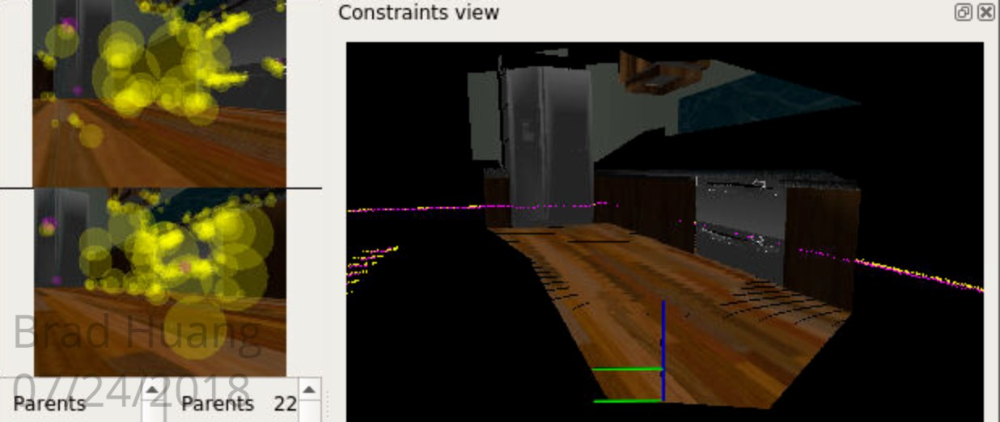

# Map My World
This project is the SLAM project of the Udacity Robotics Software Engineer Nanodegree. For the project, I applied the Real-Time Appearance Based Mapping (RTAB-Map) in ROS to perform SLAM in a simulated environment. See the writeup for an extended discussion of the theoretical content on SLAM algorithms and specifics of RTAB-Map.

## Installation & Build
### ROS Kinetic
The project was developed on Ubuntu 16.04 LTS with [ROS Kinetic](http://wiki.ros.org/kinetic), [Gazebo](http://gazebosim.org/) and [catkin](http://wiki.ros.org/catkin) installed.

### Dependencies
The robot relies on the ``rtabmap_ros`` ROS package, which should be installed through ``apt-get``.

### Building the Workspace
Use ``catkin`` to build the packages from source. From the ``catkin`` workspace where you cloned the repo, run:

``catkin_make; source devel/setup.bash``

to build the workspace packages and add them to the paths of ROS.

### Running the Scripts
After the above steps, you should be able to run the commands below in separate terminals:

Launch the world in Gazebo:

``roslaunch slam_project slam_world.launch``

Launch the teleop node for keyboard control:

``roslaunch slam_project teleop.launch``

Launch the RTAB-Map mapping node

``roslaunch slam_project mapping.launch``

Launch the RViz GUI:

``roslaunch slam_project rviz.launch``

## Project Content
### Directory Structure
The project repository contains source code of a ``catkin`` workspace, with some supporting code and shared object files provided by Udacity. All of them are wrapped in the ``slam_project`` package. The package includes a custom made robot model, a few world files specifying an environment in Gazebo, and a few shell scripts interfacing with the RTAB-Map library.

### Tasks
There are two tasks involved in this project: robot model configuration and ``rtabmap`` for SLAM.
#### Robot Model Configuration
The robot model was extended from the previous project ``RoboND-Where-Am-I`` and instead has an RGB-D camera to input depth information to RTAB-Map.

#### ``rtabmap`` for SLAM
The robot uses the information from the odometer, the RGB-D camera and the laser rangefinder to perform SLAM in the designated environment through ``rtabmap``. The ``rtabmap`` library produces map database files that can be read by its own visualization tools. Details of the algorithm can be found in the writeup. Here is an image of the reconstructed kitchen dining environment:

### Note on the RTAB Map Database Files
The files were too large to host on Github, so I uploaded them to Google Drive and the sharing link is [here](https://drive.google.com/drive/folders/1N4LO4P8lQAmriErj1BQz_u5RpoNVg7a9?usp=sharing).

Example of the database visualized through RTAB-Map's database viewer:

